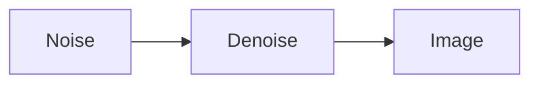

# Diffusion

## Generate an image from Gaussian Noise

通过N步Denoise从纯噪声中生成清晰图片。区分Denoise不同阶段，需要在Denoise model中输入Denoise第几步

### Denoise Model（前向过程）

1. Noise Predicter：输入图片和Denoise的程度，预测每个pixel上的杂讯大小（避免end-to-end难度太大）
2. Element-wise去除噪声：输入图片去掉Noise Predicter对应的噪声得到去噪图片 

### Training of Noise Predictor（反向过程）

能否采用监督学习的范式训练？（生成Noise的Ground Truth）

> 反向过程，对清晰图像加N步高斯噪声直到生成的图片完全是噪声，插入的噪声即为Ground Truth

### Generate a text-grounded image

设计一个Text-Grounded Denoised Model（编码Text送给Denoise Model）

## 引子：generate image from a sequence of text(从表征到生成)

输入图片，编码为Text Embedding，同时生成一个杂讯向量，和Text Embedding作为Generation Model输入生成一个中间向量（图片的语义嵌入/低分辨率图conditioned by given text）

Decoder根据图片语义生成最终图片

### 刻画生成图片好坏：FID

pretrain一个图像分类模型，生成图片送给分类模型得到Representation，对于真实图片和虚假图片Representation我们希望两个分布相近

> 假定两个分类是高斯分布，计算两者的Frechet Distance

### Decoder

单独训练，只需要纯图片输入而无需text-image pair

1. 分辨率改变：Down Sampling大图作为Decoder输入
2. Reprsentation到图片：Encoder-Decoder提取中间层特征

### Generation Model

在Latent Representation上进行正向加噪和反向去噪

## Mathematical Analysis of Diffusion Model

### Training

输入：干净图像$x_0$，总共扩散T步，第k步的加噪系数为${\alpha _t}$

1. 随机选择中间扩散步 $t\in \{1,2,\cdots,T\}$和正态分布噪声$\epsilon \in N(0,I)$
2. Loss函数希望Noise Predictor $\epsilon_\theta$生成的结果和Noise尽量接近

$$
\min_\theta \parallel \epsilon -\epsilon_\theta (\sqrt{\overline \alpha_t} x_0 + \sqrt{1- \overline\alpha_t}\epsilon,t)
$$

Noise Predictor尝试从加噪图片中**恢复**Noise，靠近真实图片Noise越小$\alpha_1<\alpha_2<\cdots <\alpha_T$

> 是否需要利用最终扩散的结果是高斯分布去约束加噪过程，算法中直接在单步加噪声

### Sampling

输入：全部为Noise的图$x_T| \mathcal N(0,I)$，进行T次去噪

1. sample高斯噪声 $z|\mathcal N(0,I)$
2. 去除上一步中的Gaussian Noise

注意$\overline{\alpha_t}$和$\alpha_t$是两组不同的参数

Max-likehood从真实分布$P_{data}$中采样若干sample，要求神经网络拟合出的分布$P_\theta$和$P_{data}$接近，等价于优化
$$
\arg\max_\theta \int_{x}P_{data}(x)\log \frac{P_\theta(x)}{P_{data}(x)} dx  =\arg\min KL(P_{data}\parallel P_\theta)
$$

> Compute $P_\theta$，VAE选择一个采样自正态分布的latent vector z作为condition，$P_\theta$写成
> $$
> P_\theta(x) =\int_z P(z) P_\theta(x|z) dz
> $$
> $P_\theta(x|z)$是一个高斯分布，理想情况下分布中心应该落在目标生成图像。最终等价于计算目标图像和生成图像之间的$L_2$距离

### DDPM计算$P_\theta$

给定数据集的一张图像$x_0$，生成过程相当于一个 马尔可夫过程
$$
x_T\to x_{T-1}\cdots \to x_0
$$
概率估算写成
$$
P_\theta(x_0) =\int P(x_T)P_\theta (x_{T-1}|x_T)\cdots P_\theta(x_0|x_1) dx_0:x_T
$$
$\max P_\theta (x_0)$等价于
$$
\max E_{q(x_1:x_T|x_0)}[\log \frac{P(x_0:x_T)}{q(x_1:x_T|x_0)}]
$$
相当于将VAE中的latent variable视为$(x_1,x_2,\cdots,x_T)$，q相当于前向过程加噪音，起到了类似于VAE Encoder的作用，也满足链式法则，这里$x_t/x_{t-1}$的关系满足
$$
x_{t} = \sqrt{1 -\beta_t}x_{t-1} + \sqrt {\beta _t} z_t\\
z_t|\mathcal N(0,I)
$$
对于$x_t/x_0$，这里有
$$
x_0 = \sqrt {1-\beta_2}(\sqrt{1-\beta_1} x_0 + \sqrt {\beta_1} z_0)+z_1
$$
