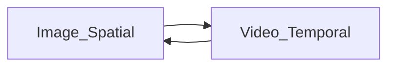

## Motivation

1. 当前VLM对于video/image visual token采取不同的压缩策略，对于前者更关注时序特征，对于后者更关注空间特征
2. 本文希望提出一个统一的vision compression方法，能够同时减少时间以及空间上的冗余

在过LLM前将所有image和video都过统一的compressor减少视觉token冗余，image被视为static video，Compressor的原理是每一帧获取上一帧不包含的visual token

## Related Work: Token Compression

1. 早起工作：通过池化/卷积/Q-Former减少token数量，存在信息损失/Learnable Query不好学等特点
2. Internvl/Qwen使用PixelShuffle降低Token数量
> Pixel Shuffle将一个$(N, C\times r^2,H,W)$的张量降低到$(N,C,r\times H,r\times H)$维度，其中$r<1$

3. 提出Video Compression特有的网络架构：spati-temporal模块，基于文本相似度选择相关性更好的token

## 方法
1. 图片被视为静态视频（重复4次）
2. 原始的视频被采样到T帧
### Progressive Encoding
>目的：编码出上一帧不存在的信息

输入：x [B,T,N,C]的video tokens，包含T帧，没帧N个C维token 
#### Spatial Multi-head attention(S-MHA)
处理每一帧生成的视觉token $[B\times T,N,C]$，每个token和同属于一张图片的其他token计算attention
#### Temporal Multi-head Attention
处理每个时间序列上的视觉token $[B\times N,T,C]$，对于属于一个时间序列上的不同tokens计算attention

#### Temporal Embedding(TE)
表示一个视频中帧的时序信息：按照均匀采样方式得到编码$t=[0,\frac{1}{T-1},\frac{2}{T-1},\cdots,1]$将其转化为position embedding $\hat t\in  R^{T\times 256}$，过一个MLP的到Frame Position Embedding
$$
TE =W_2\cdot SiLU(W_1\hat t)
$$
$W_1,W_2$为可学习的参数

结合以上机制进行progressive encoding捕获空间和时间特征

其中AdaLN是一种可学习的Normalization方法，写成
$$
AdaLN(x;z) = \gamma(z)\odot LayerNorm(x) +\beta(z)
$$
$\gamma,\beta$的计算方法和TE类似

### Adaptive Compression
输入[B,T,N,C]来自ViT的Visual Tokens x，首先将其在N维度进行pixelshuffle，转化为形状为
$$
[B,T,M,\frac N M\times C]
$$
的张量，其中$M=\frac 1 {16} N$
> 本质上还是通过PixelShuffle减少token数量，不同的是在计算$n^2$的自注意力机制之前，先加入了两个较小的自注意力层，其复杂度分别为$T^2,m^2$，其中n，T，m分别为全部token数量，视频帧数量和单个帧token数量

## Experiment

1. 评估指标：understanding/reasoning分数，每个frame token数量
2. 实验配置：2B/8B
### 实验结论

视频理解任务，64 token per frame

