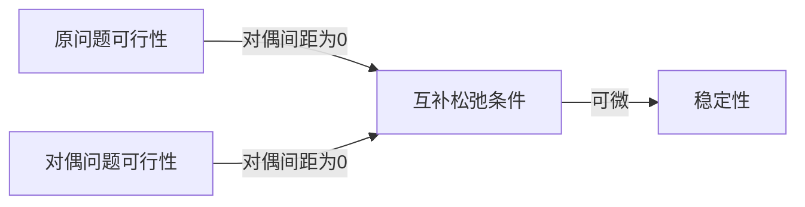

# Convex Optimization(Duality IV—论对偶间距为0的若干推论，KKT条件)

## 互补松弛条件(对于一般优化问题，对偶间隙为0)

考虑一般优化问题(不一定凸)
$$
\min f_0(x)\\
s.t \ f_i(x)\leq 0,i =1,2,\cdots,m\\
h_i(x)=0,i=1,2,\cdots,p
$$
对偶函数
$$
g(\lambda,v) = \inf_x \{f_0(x)+\sum_i \lambda_i f_i(x)+\sum_i v_i h_i(x) \}
$$
对偶问题
$$
\max g(\lambda,v)\\
\lambda \geq 0
$$
做出两个假设

1. 对偶间隙为0
2. 假设所有函数可微

假设对偶问题和原问题最优解为
$$
x^*,\lambda^*,v^*
$$
必然是可行解，满足
$$
f_i(x^*)\leq 0\\
h_i(x^*) =0\\
\lambda^*\geq 0
$$
对偶间隙为0意味着
$$
f_0(x^*) = g(\lambda^*,v^*) =\inf_x \{f_0(x)+\sum_i \lambda_i^* f_i(x)+\sum_i v_i^* h_i(x) \}
$$
$\inf$满足
$$
g(\lambda^*,v^*) \leq f_0(x^*) +\sum_i \lambda _i^* f_i(x^*)+\sum_i v_i^* h_i(x^*)\leq f_0(x^*)
$$
因此在**对偶间距为0**的前提下，上述不等式全部是等式，即

1. $L(x^*,\lambda^*,v^*) = g(\lambda^*,v^*)$
2. $L(x^*,\lambda^*,v^*) = f_0(x^*)$

等式（2）表明对于不等式约束，必然有
$$
\lambda_i^* f_i(x^*) = 0\to \lambda_i^* = 0 \or f_i(x^*) =0(\lambda_i^* =0)
$$
这被称为**互补松弛条件（Complementary Slackness）**

同时，等式（1）表明
$$
x^* ={\arg\min}_x L(x,\lambda^*,v^*)
$$
请注意，$L$关于x是**定义在全空间上的函数！**,$x^*$是L在全空间上的全局最优

根据可微条件，有
$$
\frac{\partial L(x,\lambda^*,v^*)}{\partial x} =0
$$
拆开看梯度
$$
\nabla f_0(x^*) +\sum_{i=1}^m \lambda_i^* \nabla f_i(x^*) +\sum_{i=1}^p v_i^* \nabla h_i(x^*) = 0
$$
这被称为stationary。对于得到的等式和不等式分成四类

### 原问题可行性

$$
f_i(x^*)\leq 0\\
h_i(x^*) = 0
$$

### 对偶问题的可行性

$$
\lambda_i^* \geq 0
$$

### 互补松弛条件(对偶间隙为0)

$$
\lambda_i>0\to f_i(x^*) = 0
$$

### 稳定性(函数可微)

$$
\nabla f_0(x^*) +\sum_{i=1}^m \lambda_i^* \nabla f_i(x^*) +\sum_{i=1}^p v_i^* \nabla h_i(x^*) = 0
$$

它们的关系是

这些条件被称为KKT条件

## 问题：KKT条件何时是充要条件？

> 定理：原问题满足三个条件，KKT条件是充要条件
>
> 1. 凸问题
> 2. 函数可微
> 3. 对偶间隙为0

下面证明充分性

> $(x^*,\lambda^*,v^*)$满足KKT条件$\Rightarrow,(x^*,\lambda^*,v^*)$为对偶问题和原问题最优解

实际上只要证明
$$
g(\lambda^*,v^*)= f_0(x^*)
$$
（这是因为根据minmax定理，必然有$g(\lambda,v)\leq f_0(x)$），能取到等号已经是极限

可行性条件可以得到
$$
L(x,\lambda^*,v^*) = f_0(x)+\sum_i \lambda_i^* f_i(x) +\sum_i v_i h_i(x)
$$
$h_i(x)$是仿射函数，$f_i(x)$是凸函数，因此非负加权和$L(x,\lambda^*,v^*)$关于x凸

> 凸函数一阶偏导0为全局最优

因此
$$
L(x,\lambda^*,v^*) \geq L(x^*,\lambda^*,v^*)
$$
考虑$g(\lambda,v)$，显然
$$
\begin{aligned}
g(\lambda^*,v^*)& =\inf_x L(x,\lambda^*,v^*)\\
&=L(x^*,\lambda^*,v^*)(上述证明说明x^*是L的全局最优)\\
&=f_0(x^*) +\sum_{i=1}^m \lambda^*_i f_i(x^*)+\sum_{i=1}^p v_i^* h_i(x)
\end{aligned}
$$
互补松弛条件，得到
$$
\sum_{i=1}^m \lambda_i^* f_i(x^*) = 0
$$
因此
$$
g(\lambda^* ,v^*) = f_i(x^*)
$$
得证

> 求解凸优化等价于求解KKT条件

优化问题之间的关系用一下表示
$$
A=可微优化问题\\
B=凸并且可微优化问题,B\subseteq A\\
C=满足p^* =d^*的可微优化问题,C\subseteq A\\
C\bigcap B的问题KKT是充要条件
$$

## 例子

### 半正定二次规划

$$
\min \frac{1}{2}x^T P x+q^T x + r\\
s.t\quad Ax = b
$$

写出KKT条件
$$
Ax^* = b(primal)\\
\frac{\partial L}{\partial x^*} = P x^* +q + A{v^*}^T =0
$$
两个线性方程，写成
$$
\begin{pmatrix}
P & A^T \\
A & 0
\end{pmatrix}
\begin{pmatrix}
x\\
v^*
\end{pmatrix} = \begin{pmatrix}
-q\\
b
\end{pmatrix}
$$
等价于求解线性方程组

约束改成 $Ax\geq b$，则会导致互补松弛条件极难求解

### Water filling问题

变量是x，$\alpha$是参数，满足$\alpha_i> 0$
$$
\min - \sum_{i=1}^n \log (\alpha_i+x_i)\\
s.t\ x\geq 0,1^T x = 1
$$
KKT条件(primal)
$$
x^* \geq 0\\
1^Tx^* =1
$$
对偶变量$\lambda^*$约束
$$
\lambda^* \geq 0
$$
互补松弛
$$
\lambda^*_i x_i^* =0
$$
微分条件，拉格朗日函数
$$
L(x,\lambda^*,v^*) = -\sum_{i=1}^n \log (\alpha_i+x_i)-\lambda^*{x^*}^T  +v^* (1^T x-1)
$$

> 注意$\lambda^*\in\R^n,v^*\in \R$

求微分
$$
\frac{\partial L}{\partial x_i} =- \frac{1}{\alpha_i + x_i}-\lambda^*_i+ v^*=0\\\
v^* =\lambda_i^*+\frac{1}{\alpha_i+x_i^*}
$$
微分条件等价为
$$
v^*(\alpha_i+x_i^*) =\lambda_i^*(\alpha_i+x_i^*)+1\Leftrightarrow\\
v^*(\alpha_i+x_i^*) = \lambda_i^* \alpha_i+1(\lambda_i^*x_i^*=0)\Leftrightarrow\\ 
\lambda_i^* =\frac{v^*(\alpha_i+x_i^*)-1 }{\alpha_i}\\
x_i^*=\frac{\lambda_i^* \alpha_i +1 -\alpha_i v^*}{\alpha_i}
$$
$\lambda_i^*\geq 0$等价为
$$
v^*(\alpha_i+x_i^*)-1\geq 0\to v^*\geq \frac{1}{\alpha_i +x_i^*}
$$

> 若$v^*\geq \frac{1}{\alpha_i}$，可以推导出$\lambda_i^* > 0$，则可知$x_i^* = 0$

> 若$v^*< \frac{1}{\alpha_i}$，则可知$x_i^*>0$，$x_i^* = \frac{1}{v^*}-\alpha_i$（这是因为$x_i^*>0$，必然有$\lambda_i^*=0$）

1. $v^*\geq \frac{1}{\alpha_i}\to x_i^*=0$
2. $v^*<\frac{1}{\alpha_i}\to x_i^* =\frac{1}{v^*}-\alpha_i$

#### 算法（灌水算法）

绘制$\alpha_i - i$图像

实现代表$\alpha_i-i$，虚线代表$\frac{1}{v^*}$，在$\frac{1}{v^*}$以下的区域，$x_i$取值为图上着色正方形

> 什么时候得到最优解？
>
> 提升$\frac{1}{v^*}$(提升水面高度)，使得水面以下区域高度和之和为1(primal条件)

### KKT条件和一阶最优性条件

对可微凸优化
$$
\min f_0(x)\\
s.t \quad x\geq 0
$$
最优性条件等价于
$$
x\geq 0\\
\nabla f_0(x)\geq 0\\
x_i \nabla f_0(x)_i =0(Complementary)
$$
x和$\nabla f_0(x)$互补

KKT条件
$$
x^*\geq 0\\
\lambda^*\geq 0\\
\lambda_i^* x_i^* = 0\\
\nabla f_0(x^*) -\lambda^* = 0
$$
$\lambda$和$x$互补，替换$\lambda^*$
$$
\nabla f_0(x^*)x_i^* =0\\
\nabla f_0(x^*)\geq 0
$$

### 凸问题等价形式

原问题有两种形式A,B，它们的对偶问题不一定相同
$$
\min f_0(Ax+b)
$$
$f_0$是凸函数

对偶问题是
$$
L(x) = f_0(Ax+b)\\
g(\lambda,v) = \inf_x f_0(Ax+b)\\
\max g(\lambda,v) =\inf_x f_0(Ax+b)
$$
必然有$p^*=d^*$(原问题和对偶问题完全相同)

现在考虑原问题的等价问题
$$
\min f_0(y)\\
y=Ax+b
$$
记等价问题和等价问题的对偶问题最优解为$p^*_1,d^*_1$，写出对偶问题
$$
L(y,x,v) = f_0(y) +  v^T ( Ax+b-y) = f_0(y)- v^T y +v^T Ax+v^Tb  \\
g(v) =\inf_{x,y} L(y,\lambda,v) \\
\inf_y (f_0(y)-v^Ty) =-\sup_y (v^T y -f_0(y)) =-f^*(v)(函数共轭)\\
\inf_x -v^T Ax-v^T b =-\infty(v^T A\neq 0),-v^T b(v^T A=0)
$$
注意函数L(y,x,v)中y和x解耦，不存在约束，因此可以分别求极小

得到
$$
g(v) =\left\{
\begin{aligned}
& -f^*(v)-v^Tb ,v^TA =0\\
& -\infty,v^T A\neq 0
\end{aligned}
\right.
$$
对偶问题是
$$
\max v^T b - f_0^*(v)\\
s.t\quad v^T A =0
$$
对偶问题1和原始对偶问题有很大的不同

#### 范数

$$
\min \parallel Ax-v\parallel
$$

等价问题
$$
\min \parallel y\parallel\\
s.t\quad  y = Ax -b
$$
对偶函数
$$
L(x,y,v) =\parallel y \parallel -v^T y +v^TAx -v^Tb\\
(引用上面讨论的结论)
g(v) =\inf_{x,y}L(x,y,v) =\left\{
\begin{aligned}
&-v^T b+\parallel v\parallel_*\\
&-\infty
\end{aligned}
\right.
$$
因此对偶问题是
$$
\max -v^T b -\parallel v\parallel_*\\
s.t\quad v^T A=0
$$
上述问题的**值**和下列问题等价
$$
\max\ v^T b-\parallel v\parallel_*\\
s.t\quad v^T A =0
$$

> 可以理解为用w代替-v，得到
> $$
> \max w ^T b -\parallel v\parallel_*\\
> s.t\quad w^T A=0
> $$

因此这两个问题的值相同

对原问题还有一种变换
$$
\min \frac{1}{2}\parallel y \parallel^2\\
s.t\quad Ax -b = y
$$

> 两个问题**解**是等价的，这两个问题等价本质上来自于范数的非负性，因此约束目标实际上是等价的
> $$
> \min \parallel y \parallel\Leftrightarrow\min \parallel y \parallel^2
> $$

它的对偶问题写成
$$
L(x,y,v) =\frac{1}{2}\parallel y \parallel^2 +v^T (Ax - b -y)\\
g(v) =\inf_{x,y} L(x,y,v) =\left\{
\begin{aligned}
& -v^T b-\frac{1}{2}\parallel v\parallel_*^2,v^T A =0\\
&-\infty ,v^TA \neq 0
\end{aligned}
\right.
$$
对偶问题是
$$
\max  -v^T b -\frac{1}{2}\parallel v\parallel_*^2\\
s.t\quad v^T A=0
$$
约束目标不同

### 带框约束的线性规划问题

约束是高维空间的立方体
$$
\min c^T x\\
s.t\quad Ax=b\\
l\leq x\leq u
$$

$$
\begin{aligned}
L(x,\lambda_1,\lambda_2,v) &=c^T x +v^T(Ax - b)+\lambda_1^T (l-x)+\lambda_2^T (x-u)\\
&= (c^T +v^T A-\lambda^T_1+\lambda_2^T) x-v^T b +\lambda_1^T l-\lambda_2^T u
\end{aligned}
$$

对偶问题
$$
\max -b^T v+\lambda_1^T l-\lambda_2^T u\\
s.t\quad A^T v+c^T -\lambda_1^T+\lambda_2^T =0,\lambda_1\geq 0,\lambda_2\geq 0
$$
仍然是线性规划，对原问题做等价变换(将目标函数和框约束写成一个形式)
$$
\min f_0(x)\\
s.t\quad Ax = b\\
f_0(x) =\left\{
\begin{aligned}
&c^T x,l\leq x\leq u\\
&\infty ,else
\end{aligned}
\right.
$$
这个问题对偶问题
$$
L(x,v) =f_0(x)+v^T (Ax -b)\\
g(v) =\inf_x f_0(x)+v^T (Ax - b) = \inf_{x\in [l,u]} c^T x+v^T(Ax - b)
$$
最终还是一个框约束的线性规划
$$
g(v) =\inf_{x\in [l,u]} (A^Tv +c)^T x-v^T b
$$
不包含等式约束让问题变得简单，观察
$$
A^T v+c
$$
这是一个n维向量，记作$(w_1,w_2,\cdots,w_n)$，显然，如果

1. $w_i\geq 0\to x_i = u$
2. $w_i<0\to x_i = l$

解记作
$$
g(v) = -v^T v +l^T (A^T v +c)^+-u^T (A^T v+c)^-
$$
