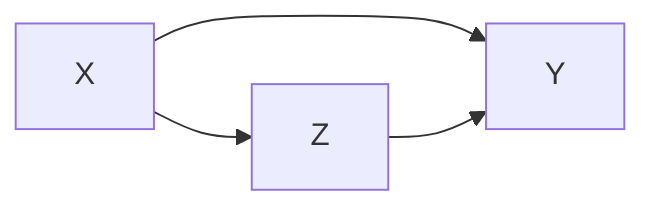

# Information Theory(Information Measures of Discrete Systems)

随机事件E信息量$\Tau(E)$的衡量满足三个条件

1. 是随机事件E发生概率$Pr(E)$的单调递减函数
2. $T(E)$是$Pr(E)$的连续函数
3. 独立事件$E_1,E_2$交集的量度等于两者量度之和$T(E_1\bigcap E_2) = T(E_1)+T(E_2)$
4. $T(E)\geq 0$，了解一个事件不会让不确定度降低

> 唯一符合以上公设的数学形式写成
> $$
> I(p)= -c \log_b (p)
> $$
> $c,b>0$

信息量表明对于一个随机事件，如果其发生对于我们的**启发**，显然概率越小的事件发生价值越大

Entropy视为事件发生的信息量的期望
$$
H(X) = E[T(X)]=\sum P_X(x)  \log_b \frac{1}{P_X(x)}
$$
介绍一些数学结论
$$
1-\frac 1 x\leq \ln x \leq x-1\\
\log_D (x)\leq \log_D(e)(x-1)
$$
Upper Bound of Entropy
$$
H(X)\leq \log_2 |X|
$$
Uniform的概率分布entropy最大

Log-sum inequality
$$
\sum_i a_i \log_D \frac {a_i}{b_i} \geq \sum_i a_i( \log_D \frac{\sum_i a_i}{\sum_i b_i})
$$
prove
$$
\sum_i a_i (\log _D \frac{\sum_i a_i}{\sum_i b_i} -\log_D \frac{a_i}{b_i})\leq \sum_i a_i(\frac{b_i\sum a_i}{a_i \sum_i b_i}-1)=0
$$
Joint Entropy刻画了多个随机变量的信息增益
$$
H(X,Y) = E_{x,y|P_{X,Y}}[-\log_2 P_{X,Y}(X,Y)]
$$
Conditional Entropy定义类似，给定发送端数据X条件下，接收端得到的信息增益
$$
H(Y|X) = E_{x}[H(Y|x)]
$$
Chain Rule
$$
H(X,Y) = H(X) + H(Y|X)
$$
共有信息量=发送端信息量+传输端条件信息量

考虑三者传输

满足
$$
H(X,Y|Z) = H(X|Z) + H(Y|X,Z)\\
p(x,y|z) = \frac{p(x,y,z)}{p(z) }= \frac{p(x,y,z)\times p(x,z)}{p(x,z)\times p(z)}= p(y|x,z)p(x|z)
$$
Side Information告诉我们引入一个新的conditional side information不会让系统不确定性增加
$$
H(Y|X)\leq H(Y)
$$
同理
$$
H(X_1,X_2|Y_1,Y_2)\leq H(X_1|Y_1) + H(X_2|Y_2)
$$
Mutual information用于表示H(Y|X)和H(X|Y)的交集
$$
I(X;Y) = H(X) - H(X|Y) = H(X)+ H(Y) - H(X,Y)=D(P_{X,Y}\parallel P_X P_Y)
$$
$I(X;Y )= 0$代表X和Y相互独立，这代表我们的信道不能正确传输信息（信道能传送的信息）

考虑多个输出端的情况
$$
I(X;Y,Z)=D(P_{X,Y,Z}\parallel P_X P_{Y,Z})
$$
X同时送给Y和Z，满足
$$
I(X;Y,Z)= I(X;Y) + I(X;Z|Y)\\
I(X;Z|Y) = \sum_y P_Y(y) I(X|y;Z|y)=\sum_u P_Y(y) D(P_{(X,Y)|z}\parallel P_{X|y}\times P_{Z|y})
$$
以上用到了[条件互信息](https://en.wikipedia.org/wiki/Conditional_mutual_information)，可以写成

显然可以拆分成
$$
\begin{aligned}
I(X;Y|Z) &= \sum_{x,y,z} p_{X,Y,Z}(x,y,z)\log \frac{P_{X,Y,Z}(x,y,z)}{P_{Y,Z}(y,z)}\\
&+\sum_{x,y,z}P_{X,Y,Z}(x,y,z) \log \frac{P_Z(z)}{P_{X,Z}(x,z)} \\
&=D(P_{X,Y,Z}\parallel P_{Y,Z}) - D(P_{X,Z}\parallel P_Z)\\
&=I(X;Y,Z) - I(X,Z)
\end{aligned}
$$
扩展到多到一的场景
$$
H(X_1,X_2,\cdots,X_n;Y) = \sum_{i=1}^n H(X_i;Y|X_1,\cdots,X_{i-1})
$$
Entropy也遵循类似的Chain Rule
$$
H(X_1,X_2,\cdots,X_n) = \sum_{i} H(X_i|X_1,X_2,\cdots,X_{i-1})\leq \sum_i H(X_i)
$$
同理考虑多对多的传输
$$
I(X_1,X_2;Y_1,Y_2)\leq I(X_1;Y_1) + I(X_2;Y_2)
$$
取等号满足
$$
P(y_2,y_1|x_2,x_1) = p(y_2|x_2)p(y_1|x_1)
$$
时序上互相独立

一起传输不如一对一传输的效率高
