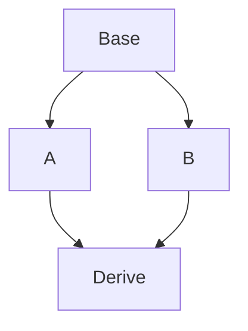

# C++拾遗(菱形继承、虚继承)

## 菱形继承

一个类继承自两个父类，同时两个父类继承自同一基类

### 基础知识：C++类的继承

调用派生类构造函数之前，先调用基类构造函数，如果基类的构造函数存在多个，我们可以采用如下的方式手动选择调用特定的构造函数

```cpp
class Base{
    Base(){
        // Default init
    }
    Base(param_list){
        // another init
    }
};
class Derive:public Base{
    Derive(param_list): Base(param_list){
        // call the base init
    }
};
```

构造函数不能为虚函数（先需要构造虚表，然后向虚表中填写实际调用地址实现运行时绑定）

### 菱形继承

一个菱形继承的例子是

```cpp
class Base{
public:
    int x;
    Base(){
        x = 1;
    }
};
class Derive1: public Base{
public:
    Derive1(){
        x = 2;
    }
};
class Derive2: public Base{
public:
    Derive2(){
        x = 3;
    }
};
class Derive: public Derive1,public Derive2{};
```

直接访问Derive类的x对象会报错ambigious，因为两个基类的成员变量x在内存中保存了两份，`sizeof(Derive)`输出8，写一段代码验证这一点（同理也适用于两个派生父类同时重写了基类的某个函数的情况）

```cpp
    Derive d;
    int * ptr = (int *)&d;
    cout << *ptr << endl;
    ptr = ptr + 1;
    cout << *ptr << endl;
```

输出2和3

> 解决二义性的一个办法是使用::运算符访问对象，例如在Derive类的方法中，使用`Derive1::x`这样的访问可以精确访问某个具体的变量，但是这样做仍然会导致数据冗余

借助编译器`-fdump-class-hierarchy`选项可以生成.class文件，包含每个类的内存布局

```txt
Class Base
   size=4 align=4
   base size=4 base align=4
Base (0x0x7f5c5fbea5a0) 0

Class Derive1
   size=4 align=4
   base size=4 base align=4
Derive1 (0x0x7f5c5fa941a0) 0
  Base (0x0x7f5c5fbea780) 0

Class Derive2
   size=4 align=4
   base size=4 base align=4
Derive2 (0x0x7f5c5fa94208) 0
  Base (0x0x7f5c5fbea960) 0

Class Derive
   size=8 align=4
   base size=8 base align=4
Derive (0x0x7f5c5faa7620) 0
  Derive1 (0x0x7f5c5fa94270) 0
    Base (0x0x7f5c5fbeab40) 0
  Derive2 (0x0x7f5c5fa942d8) 4
    Base (0x0x7f5c5fbeaba0) 4
```

对于下面一个包含虚函数的派生类内存布局

```cpp
class Base{
public:
    virtual void func(){
        call_count = 1;
    }
    void call(){
        call_count = 3;
    }
};
class Derive:public Base{
public:
    void func(){
        call_count = 2;
    }
};
```

其内存布局为

```txt
Vtable for Base
Base::_ZTV4Base: 3u entries
0     (int (*)(...))0
8     (int (*)(...))(& _ZTI4Base)
16    (int (*)(...))Base::func

Class Base
   size=8 align=8
   base size=8 base align=8
Base (0x0x7f5efa6125a0) 0 nearly-empty
    vptr=((& Base::_ZTV4Base) + 16u)

Vtable for Derive
Derive::_ZTV6Derive: 3u entries
0     (int (*)(...))0
8     (int (*)(...))(& _ZTI6Derive)
16    (int (*)(...))Derive::func

Class Derive
   size=8 align=8
   base size=8 base align=8
Derive (0x0x7f5efa4bc1a0) 0 nearly-empty
    vptr=((& Derive::_ZTV6Derive) + 16u)
  Base (0x0x7f5efa6126c0) 0 nearly-empty
      primary-for Derive (0x0x7f5efa4bc1a0)
```

如果不用virtual做方法重写

```txt
Class Base
   size=1 align=1
   base size=0 base align=1
Base (0x0x7f0e6abb75a0) 0 empty

Class Derive
   size=1 align=1
   base size=1 base align=1
Derive (0x0x7f0e6aa611a0) 0 empty
  Base (0x0x7f0e6abb76c0) 0 empty
```

派生类增加了一个虚表，即增加了一个对象，指向虚表，因此带虚继承的派生类size为8，无虚继承的size为1

回到菱形继承的case，如果我们希望减少对同一个base继承产生的二义性，虚继承的本质是
$$
\textbf{虚继承将两个派生父类派生的两个不同基类统一到了一个，即Derive1::base实际上和Derive2::base完全相同}
$$
虚继承只需要修改`Derive1/Derive2`为

```cpp
class Derive1: virtual public Base{
    //
};
class Derive2: virtual public Base{
    //
};
```

此时的内存布局为、

```txt
Class Base
   size=4 align=4
   base size=4 base align=4
Base (0x0x7f48512935a0) 0

Vtable for Derive1
Derive1::_ZTV7Derive1: 3u entries
0     8u
8     (int (*)(...))0
16    (int (*)(...))(& _ZTI7Derive1)

VTT for Derive1
Derive1::_ZTT7Derive1: 1u entries
0     ((& Derive1::_ZTV7Derive1) + 24u)

Class Derive1
   size=16 align=8
   base size=8 base align=8
Derive1 (0x0x7f485113d1a0) 0 nearly-empty
    vptridx=0u vptr=((& Derive1::_ZTV7Derive1) + 24u)
  Base (0x0x7f4851293780) 8 virtual
      vbaseoffset=-24

Vtable for Derive2
Derive2::_ZTV7Derive2: 3u entries
0     8u
8     (int (*)(...))0
16    (int (*)(...))(& _ZTI7Derive2)

VTT for Derive2
Derive2::_ZTT7Derive2: 1u entries
0     ((& Derive2::_ZTV7Derive2) + 24u)

Class Derive2
   size=16 align=8
   base size=8 base align=8
Derive2 (0x0x7f485113d208) 0 nearly-empty
    vptridx=0u vptr=((& Derive2::_ZTV7Derive2) + 24u)
  Base (0x0x7f48512939c0) 8 virtual
      vbaseoffset=-24

Vtable for Derive
Derive::_ZTV6Derive: 6u entries
0     16u
8     (int (*)(...))0
16    (int (*)(...))(& _ZTI6Derive)
24    8u
32    (int (*)(...))-8
40    (int (*)(...))(& _ZTI6Derive)

Construction vtable for Derive1 (0x0x7f485113d270 instance) in Derive
Derive::_ZTC6Derive0_7Derive1: 3u entries
0     16u
8     (int (*)(...))0
16    (int (*)(...))(& _ZTI7Derive1)

Construction vtable for Derive2 (0x0x7f485113d2d8 instance) in Derive
Derive::_ZTC6Derive8_7Derive2: 3u entries
0     8u
8     (int (*)(...))0
16    (int (*)(...))(& _ZTI7Derive2)

VTT for Derive
Derive::_ZTT6Derive: 4u entries
0     ((& Derive::_ZTV6Derive) + 24u)
8     ((& Derive::_ZTC6Derive0_7Derive1) + 24u)
16    ((& Derive::_ZTC6Derive8_7Derive2) + 24u)
24    ((& Derive::_ZTV6Derive) + 48u)

Class Derive
   size=24 align=8
   base size=16 base align=8
Derive (0x0x7f4851150620) 0
    vptridx=0u vptr=((& Derive::_ZTV6Derive) + 24u)
  Derive1 (0x0x7f485113d270) 0 nearly-empty
      primary-for Derive (0x0x7f4851150620)
      subvttidx=8u
    Base (0x0x7f4851293c00) 16 virtual
        vbaseoffset=-24
  Derive2 (0x0x7f485113d2d8) 8 nearly-empty
      subvttidx=16u vptridx=24u vptr=((& Derive::_ZTV6Derive) + 48u)
    Base (0x0x7f4851293c00) alternative-path
```

此时`sizeof(Derive)`为24，因为其包含一个int变量以及两个指针（虚继承指向的基类指向一张表，表中存在若干指针，每个指针指向一个基类）

### Diamond Hierarchy From memory layout perspective

#### 普通的单继承

派生类继承了基类的所有属性和行为，需要保存基类的所有副本

```cpp
class A{
    int a;
    int b;
};
class B:public B{
    int x;
    int y;
};
```

B的内存布局为

| 起始地址（偏移量） | 内存   |
| ------------------ | ------ |
| 0                  | `A::a` |
| 4                  | `A::b` |
| 8                  | `B::x` |
| 12                 | `B::y` |

### 多继承

对于一个最简单的多继承

```cpp
class Base1{
    int x;
}
class Base2{
    int y;
};
class Derive{
    int z;
};
```

内存布局为

| 偏移 | 内存        |
| ---- | ----------- |
| 0    | `Base1::x`  |
| 4    | `Base2::y`  |
| 8    | `Derive::z` |

### virtual虚函数

对于virtual修饰的方法

```cpp
class Base{
public:
    virtual void func(){
        cout << "Base\n";
    }
};
class Derive:public Base{
public:
    void func(){
        cout << "Derive\n";
    }
    int x;
};

```

Base类包含一个指针成员（vfptr），指向虚表，虚表中的每一项是一个函数指针，Base指针调用虚方法的过程

之前我们提到过，C++中所谓的类方法本质上就是接收一个类对象的函数，这种将调用自身的函数保存在一张表的过程有点类似于回调

### 菱形继承和虚继承

对于我们之前给到的一个虚继承的例子

```cpp
class Base{
public:
    int x;
    Base(){
        x = 1;
    }
};
class Derive1: virtual public Base{
public:
    Derive1(){
        x = 2;
    }
};
class Derive2: virtual public Base{
public:
    Derive2(){
        x = 3;
    }
};
class Derive: public Derive1, public Derive2{};
```

通过这段代码查看内存内容`sizeof(Derive)=24`

```cpp
    Derive d;
    int * virtual_ptr = (int *)&d;
    for(int i = 0;i < 6;i++){
        cout << *virtual_ptr << endl;
        virtual_ptr++;
    }
```

输出

```
687893688
21854
687893712
21854
3
21854
```

说明实际上包含两个指针，最后int为了和8比特对齐被扩展到了8比特，下面分析虚继承

```cpp
class Base{
    int b;
};
class Derive:virtual public Base{
    int x;
};
```

和显式继承

```cpp
class Derive:public Base{
    int x;
};
```

两者的内存布局不同，显示继承需要存储基类所有对象，对于虚继承，一个内存布局为

| 偏移 | 内存            |
| ---- | --------------- |
| 0    | `Derive::vbptr` |
| 8    | `Derive::x`     |
| 12   | `Base::b`       |

类大小为16字节，其中`Derive::vptr`指向一个虚表，派生类中基类的存储内容在派生类成员变量后，虚继承的不同之处还在于将会把自己的成员变量放在前面，底层来看，指向虚基表`virtual table`的指针`vbptr`指向的表中的是保存的基类距离自身的相对偏移，例如这里可能虚表第一项是12，对于虚继承



不考虑虚函数的情况，类A和B大小均为16（8+8，其中包含4字节对齐），其中包含一个指向虚表的指针，两者最终指向的虚拟地址是一样的，类

```cpp
class Base{
public:
    int x = 7;
};
class A:virtual public Base{};
class B:virtual public Base{};
class Derive:public A,public B{};
```

实例化一个Derive类，大小为24（8+8+4+4）

| 偏移 | 内存       | 备注           |
| ---- | ---------- | -------------- |
| 0    | `A::vbptr` | 指向A虚表      |
| 8    | `B::vbptr` | 指向B虚表      |
| 16   | `Base:x`   | 共同继承的虚类 |

`Derive d`使用gdb查看虚表内容

```shell
info locals
```

```shell
d = {<A> = {<Base> = {x = 7}, _vptr.A = 0x555555755cc0 <vtable for Derive+24>}, <B> = {
    _vptr.B = 0x555555755cd8 <VTT for Derive>}, <No data fields>}
```

查看两个虚表存储内容，虚表中第二项分别存储16和8，和虚函数表不同，虚继承表存储的是相对位置，最终的派生类`Derive`实际上继承的是两个虚继承表指针


